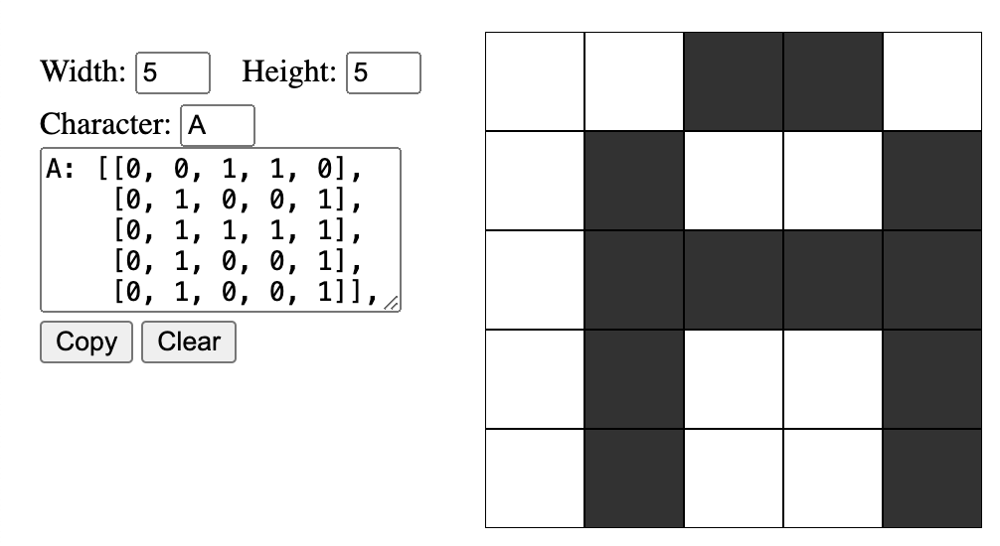

# Pixelwise Font/Sprite Generator

[p5.js](https://p5js.org/) sketch that allows selecting active cells to define a pixelwise character bitmap. Similarly implemented in React [here](https://github.com/becpeck/draw-grid).

Generates a 2-Dimensional array of `1` / `0` values for pasting into a `fontLibrary` object of the shape:

```
const alphabet = {
    A: [[0, 0, 1, 1, 0],    //            █  █
        [0, 1, 0, 0, 1],    //         █        █
        [0, 1, 1, 1, 1],    //   ===>  █  █  █  █
        [0, 1, 0, 0, 1],    //         █        █
        [0, 1, 0, 0, 1]],   //         █        █


    B: [[0, 1, 1, 1, 0],    //         █  █  █
        [0, 1, 0, 0, 1],    //         █        █
        [0, 1, 1, 1, 1],    //   ===>  █  █  █  █
        [0, 1, 0, 0, 1],    //         █        █
        [0, 1, 1, 1, 0]],   //         █  █  █


    {...}
}
```


